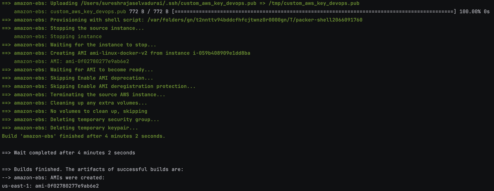
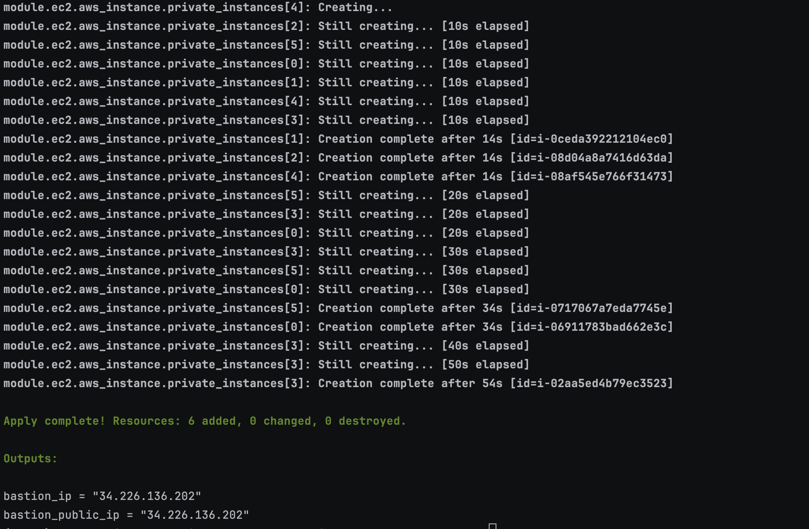

# 🚀 Packer AMI Build Setup Guide

## 📄 Prerequisites

### Install Packer

For MacOs, install it directly:

```bash
brew tap hashicorp/tap
brew install hashicorp/tap/packer
```

### Generate SSH Key
```bash
ssh-keygen -t rsa -b 4096 -f ~/.ssh/custom_aws_key_devops
```

### 📝 `variables.json`

This file contains the path to your public SSH key. You will need to update the following placeholders with your own values:

```json
{
  "ssh_public_key_path": "KEY_PATH"  # Replace with the path to your public SSH key
}
```
### 🚀 Run Packer Build
```bash
packer build -var-file=variables.json amazon-linux-docker.json
```

# Terraform AWS Setup

This project provisions the following AWS resources:

- A VPC with public and private subnets.
- An internet gateway for external access.
- One Bastion Host in the public subnet (only accessible from a specific IP).
- Six EC2 instances in the private subnet (using an AMI created via Packer).
- Security groups for Bastion and EC2 instances.

## 🛠️ Requirements

- Terraform >= 1.x
- AWS CLI configured with valid credentials

## 📜 Steps to Deploy

1. [terraform.tfvars](terraform-aws-setup/terraform.tfvars) :
This file contains the path to configure the ip from where the bastion host will be accessed
Change this to your IP
```bash
allowed_ip = "IP_ADDR/32"
```

- Initialize Terraform:
```bash
terraform init
```

- Plan/review Terraform:
```bash
terraform plan
```

- Apply Terraform:
```bash
terraform plan
```

🖼️ Screenshots

- Screenshot 1: Packer creating the image

- Screenshot 2: Terraform output

